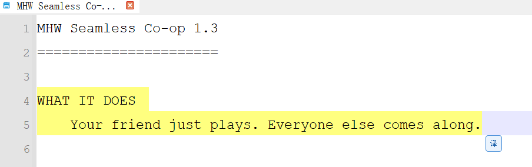
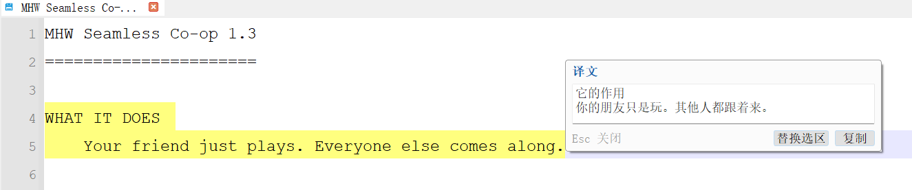

# ndd DeepSeek 翻译插件





给国产跨平台文本编辑器 **notepad--（ndd）** 写的原生 C++ 插件。

选中一段文本 → 编辑器角落出现「译」按钮 → 点一下，旁边浮窗显示 DeepSeek 译文。

- 宿主版本：notepad-- v3.9.0（Windows x64）
- 插件文件：`<ndd安装目录>\plugin\ndd-deepseek-translate.dll`
- 版本：v1.2.0
- 许可：**GPL-3.0**（见 [LICENSE](LICENSE)）

---

## 安装

**方式一（推荐）**：下载 `ndd-deepseek-translate-v1.2.0-win64.zip`，把里面的 DLL 复制到
`<ndd安装目录>\plugin\`。

**方式二**：自己构建后运行

```powershell
powershell -NoProfile -ExecutionPolicy Bypass -File tools\install_to_ndd.ps1
```

两种方式都注意：**先完全关闭 ndd**（DLL 被占用时无法覆盖），装好后**重启 ndd**。
菜单栏「插件」下会出现「DeepSeek 翻译」。

---

## 使用

1. 菜单「插件 → DeepSeek 翻译 → 设置…」，填入 DeepSeek API Key，点「测试连接」确认通了，再「保存」。
2. 在编辑器里**选中一段文本**，编辑器角落出现「译」按钮。
3. **点「译」**，选区旁浮出译文窗口。窗口里可以：
   - **复制**：译文放进剪贴板
   - **替换选区**：用译文替换选中的文本（可 Ctrl+Z 整体撤销）
   - `Esc` 或点界面别处关闭

### 菜单项

| 菜单项     | 说明                                                |
| ------- | ------------------------------------------------- |
| 翻译选中文本  | 不用点按钮，直接翻译当前选区，快捷键 **Ctrl+Alt+T**                 |
| 设置…     | API Key、模型、语言、提示词、按钮位置、超时                         |
| 重新载入配置  | 手改了 ini 之后不用重启                                    |
| **诊断…** | 列出插件实际看到的状态（宿主绑定、编辑器、按钮、配置、传输层）。**按钮不出现或报错时先看这个** |
| 关于      | 版本与配置文件路径                                         |

### 一些设计取舍

- **按钮不抢焦点**，点它不会让编辑器失焦、选区变灰。
- **hex / 大文本 / 只读模式下不显示按钮**，避免误改二进制文件。
- **选区过长直接拒绝**（默认上限 20000 字符），防止误选整篇大文件发出又慢又贵的请求。
- **纯符号/纯数字不送翻译**，本地判断即可。
- **「替换选区」前会比对选区是否变过**，翻译期间你改了选区就拒绝，避免写错位置。

---

## 配置

配置文件：`%APPDATA%\notepad\deepseek-translate.ini`

| 键                 | 默认值                        | 说明                                         |
| ----------------- | -------------------------- | ------------------------------------------ |
| `apiKeyProtected` | —                          | API Key，用 Windows DPAPI 加密（绑定当前用户），不是明文    |
| `baseUrl`         | `https://api.deepseek.com` | 也接受带 `/v1` 的写法                             |
| `model`           | `deepseek-chat`            | 可选 `deepseek-reasoner`（会自动不发送 temperature） |
| `temperature`     | `1.0`                      | 0~2                                        |
| `sourceLang`      | `自动检测`                     |                                            |
| `targetLang`      | `中文`                       |                                            |
| `systemPrompt`    | 见代码                        | 翻译规则提示词，可自行调优                              |
| `timeoutMs`       | `60000`                    | 5000~300000                                |
| `buttonPlacement` | `corner`                   | `corner`=编辑器右下角；`selection`=贴着选区末尾         |

---

## 构建（开发者）

### 前置条件

| 组件            | 要求                     | 本机现状                          |
| ------------- | ---------------------- | ----------------------------- |
| Visual Studio | 含"使用 C++ 的桌面开发"，x64    | ✅ VS 18 BuildTools，MSVC 14.51 |
| CMake         | ≥ 3.16                 | ✅ 4.3.1（随 VS 提供）              |
| Qt            | **5.15.2 msvc2019_64** | ✅ `C:\Qt\5.15.2\msvc2019_64`  |

> 必须用 **MSVC**（不能用 MinGW）、只构建 **Release**，否则与宿主的 C++ 对象/运行库不匹配会崩。

在 **x64 Native Tools Command Prompt for VS** 里：

```powershell
cmake -S . -B build -G "Visual Studio 18 2026" -A x64 `
      -DCMAKE_PREFIX_PATH=C:/Qt/5.15.2/msvc2019_64 `
      -DNDD_PLUGIN_DIR="C:/Users/Bob/software/Notepad--v3.9.0-win10-portable/plugin"

cmake --build build --config Release
```

`-DNDD_PLUGIN_DIR=...` 可选，填了会在构建后自动把 DLL 拷到 ndd 的 `plugin` 目录。
产物：`build\plugin\ndd-deepseek-translate.dll`。

**首次配置会自动生成导入库**：ndd 只给了运行期 `qmyedit_qt5.dll`，不给 `.lib`。仓库里提交了
纯文本的 `.def` 符号表，CMake 会在配置阶段用 `lib.exe` 自动转成 `.lib`，clone 下来直接配置即可。

### 目录结构

```
ndd-deepseek-translate/
├── CMakeLists.txt
├── src/                     插件源码（入口、助手、浮窗、API 客户端、设置、配置、宿主交互）
├── tests/                   网络层冒烟测试 + 端到端测试（默认关闭）
├── third_party/             ndd 插件 SDK 头 + QScintilla 头 + 导入库符号表
├── tools/                   安装、生成导入库、ABI 检查、mock 服务器、打包等脚本
└── optional/                早期「整篇文档翻译」实现，不在构建里
```

### 联调测试（不需要真实 API Key）

网络层（请求组装 / 鉴权头 / 响应解析 / 状态码映射 / 取消语义）可以完全独立测试：

```powershell
cmake -S . -B build -DCMAKE_PREFIX_PATH=C:/Qt/5.15.2/msvc2019_64 -DNDD_BUILD_TESTS=ON
cmake --build build --config Release

# 另开一个窗口起 mock 服务器
python tools\mock_deepseek_server.py 18080 build\mock_request.json

$env:PATH = "C:\Qt\5.15.2\msvc2019_64\bin;$env:PATH"
.\build\plugin\ndd-translate-client-test.exe http://127.0.0.1:18080/ok
.\build\plugin\ndd-translate-client-test.exe http://127.0.0.1:18080/slow cancel
.\build\plugin\ndd-translate-client-test.exe http://127.0.0.1:18080/unauthorized
```

### 升级 ndd 后必做

换成新的 `qmyedit_qt5.dll` 后跑一次 ABI 一致性检查：

```powershell
python tools\check_qsci_abi.py
```

它比对 QScintilla 头文件与 DLL 的虚函数集合，确认虚表布局对得上——**对不上会导致运行期行为诡异甚至崩溃**，
所以插件刻意只用非虚函数、避开对虚表布局的依赖。详见 `tools/check_qsci_abi.py` 与源码注释。

### Windows 环境下的三个坑（已处理，改代码时注意）

1. **新 MSVC STL 删掉了 `stdext`**，Qt 5.15.2 会编译不过 → 工程用 `/FI` 强制包含
   `src/compat/qt_stdext_shim.h` 修正，别删 CMakeLists 里那行。
2. **`qsciglobal.h` 必须打开 `QSCINTILLA_DLL`**，否则编译链接都过、一加载就崩 → CMake 配置期有护栏拦截。
3. **头文件与 DLL 并非同一修订**，虚函数调用可能跳错槽位 → 改动 `src/` 时只用非虚函数、
   虚函数写成限定名 `editor->QsciScintilla::xxx(...)`、不要 `new` 或继承 `QsciScintilla`。

---

## 排错

| 现象                          | 原因 / 处理                                             |
| --------------------------- | --------------------------------------------------- |
| 「插件」菜单里没有「DeepSeek 翻译」      | DLL 没放进 `<exe目录>\plugin\`；或放进去后没重启；或宿主是便携版/不支持插件的版本 |
| 加载时直接崩溃                     | 环境不匹配（必须 MSVC x64 + Qt 5.15.2 + Release），或第 2 个坑没处理 |
| 编译报 `stdext: 找不到标识符`        | 确认 CMakeLists 里 `/FI...qt_stdext_shim.h` 那行还在       |
| 界面中文乱码                      | 编译时漏了 `/utf-8`；CMakeLists 已默认加上                     |
| 选中文本后按钮不出现                  | 正常保护：hex / 大文本 / 只读模式下不显示，或当前不是普通文本视图               |
| 按钮位置不对/被遮住                  | 换「设置 → 悬浮按钮 → 出现位置」，或改成"贴着选区末尾"                     |
| 链接错误指向 `QsciScintilla::xxx` | 导入库没生成成功，手动跑 `tools\gen_import_lib.ps1`（见构建一节）      |
| 提示 `HTTP 401` / `HTTP 402`  | Key 不对 / 账户余额不足，菜单「设置…」里点「测试连接」                     |
| 提示"选中的内容太长"                 | 选区超过 20000 字符，只选中要翻译的部分                             |

---

## 许可

本项目以 **GPL-3.0** 发布。
